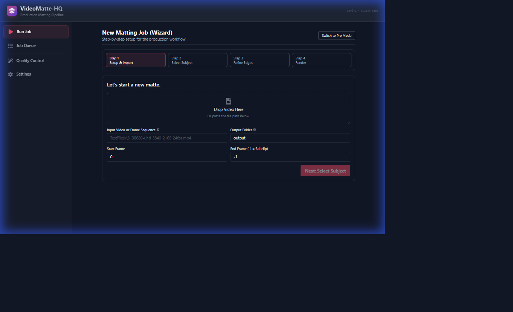
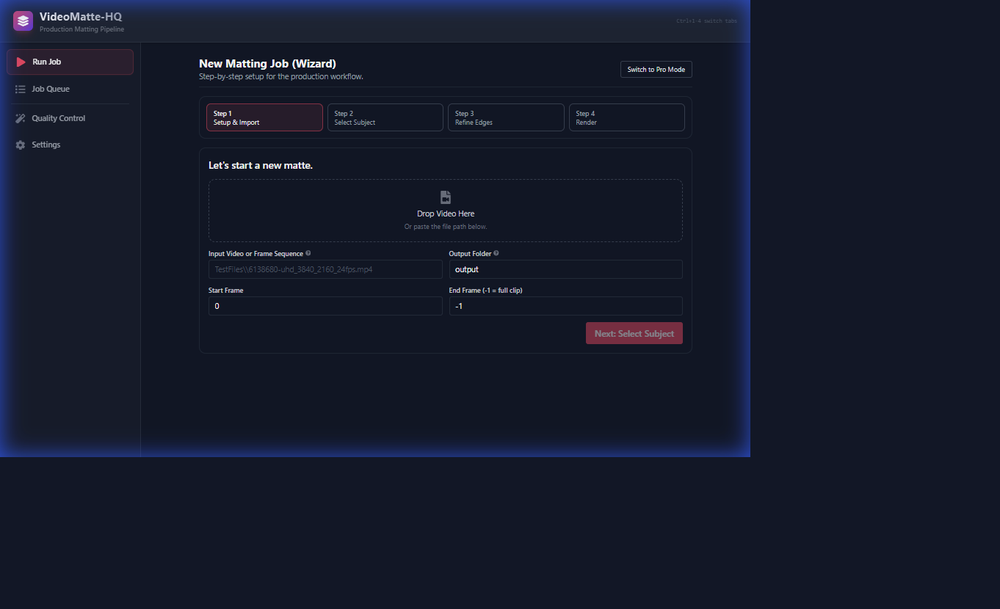
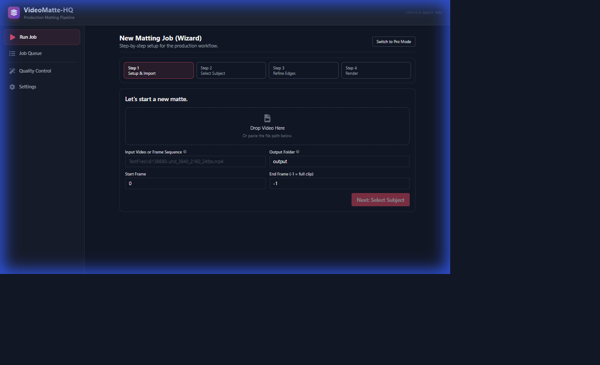

# VideoMatte-HQ Beginner Guide

This guide is for first-time users who want the easiest path.

This build is locked to the production workflow:
`SAM2/Samurai tracking -> MatAnyone coarse alpha -> MEMatte refinement -> optional matte cleanup`.



## 1) Before You Start

- You need Windows and Python 3.10 or newer.
- You should have:
  - A video file (or image sequence)
  - Optional: a mask image for a keyframe (usually frame 0)

## 2) One-Time Setup

1. Open **PowerShell** in the folder `D:\Videomatte-HQ`.
2. Run these commands:

```powershell
python -m venv .venv
.\.venv\Scripts\pip install -e .
```

This creates the local Python environment and installs the tool.

## 3) Start the Web App (Recommended)

1. In the same PowerShell window, run:

```powershell
run_web.bat
```

2. Open your browser to:

`http://localhost:5173`

## 4) Run Your First Matte (Wizard Mode)

The interface defaults to **Wizard Mode**, which guides you through the process in 4 simple steps.

### Step 1: Setup
- **Input**: Drag and drop your video file or browse to select it.
- **Output**: Choose where to save the matte files.
- Click **Next**.


### Step 2: Select Subject
This is where you define who to mat.
1. Click **Load Frame** to see your video.
2. **Auto-Detect**: Type a prompt like "person" and click Auto-Detect, OR
3. **Manual**: Use the **Box** tool to draw around your subject.
4. Click **Build Anchor Mask**.
5. Once the mask appears and looks good, click **Next**.


### Step 3: Refine Edges
Adjust the edge quality of your matte.
- **Tightness**: Pulls the edge in (negative) or pushes it out (positive).
- **Softness**: Feathers the edge transparency.
- **De-Spill**: Removes green/blue color cast from the subject.
- Click **Next**.



### Step 4: Render
Review your settings and start the job.
- Click **Start Pipeline**.
- The progress bar will show the job status.
- Once finished, you can view the results in the **Quality Control** tab.



### Pro Mode
If you need more control, click **Switch to Pro Mode** in the top right. This reveals the full dashboard with advanced settings for Memory, Temporal Cleanup, and more.


Quick mask-builder shortcuts:
- `F` = foreground points
- `B` = background points
- `Enter` = build mask

If you start with Pro Mode directly:

1. In **Subject Masks**, build at least one keyframe mask.
2. In **Motion Tracking**, keep region constraint enabled.
3. In **Edge Detail Refinement**, keep backend on MEMatte.
4. In **Final Edge Tuning**, start with **Balanced** preset.
5. Click **Start Pipeline**.

## 5) Check Progress and Quality

- **Job Queue** tab: shows running/completed jobs and logs
- **Quality Control** tab: compare input vs output with the A/B wipe slider
  - Use the dropdown to switch between **Alpha (Raw)**, **Checkerboard**, **White BG**, **Black BG**, or **Overlay**
  - Try **Overlay** mode to check edge quality
  - Use **J/K** or arrow keys to navigate frames, **Shift** for 10-frame jumps
- Optional: in **Run Job > Debug Stage Exports**, enable stage samples before running
  - This writes per-stage images and a diagnosis report, which is helpful when quality breaks on specific frames
- Optional: leave **Auto-export stage diagnostics when QC fails** enabled
  - If QC fails, the app will automatically write `debug_stages/diagnosis.json` + `debug_stages/diagnosis.md` so you can see which stage introduced the issue

## 6) If a Section Looks Wrong

Use a correction keyframe:

1. Make a corrected mask for the bad frame.
2. In **Subject Assignment**:
   - Set that frame number
   - Set **Anchor Type** to `Correction`
   - Choose the corrected mask path
   - Click **Import Mask**
3. Keep **Auto-Apply Suggested Range** enabled.
4. Run again.

## 7) Where Files Are Saved

- Alpha output frames: `output\alpha\...`
- QC report: `output\qc\optionb_report.md`
- QC metrics JSON: `output\qc\optionb_metrics.json`
- Project file: usually `output\project.vmhqproj`
- Stage debug artifacts (if enabled): `output\debug_stages\...`

## 8) Quick Matte Tuning Tips

- **Shrink/Grow**:
  - Positive = expands matte
  - Negative = tightens matte
- **Feather**:
  - Higher = softer edges
- **Offset X/Y**:
  - Moves matte left/right/up/down by pixels
- **Trimap Width**:
  - Wider values can help difficult hair edges
- **Temporal Cleanup (Stage 4) Flicker Controls**:
  - Turn on **Smooth inside edge band (micro-EMA)** for edge shimmer
  - Keep **Use confidence-gated clamp** enabled for stability in hard motion
  - Use **Edge snap guidance filter** only when edges wobble and you need extra tightening

## 9) Quick Troubleshooting

- If the web UI does not open:
  - Make sure `run_web.bat` is still running
  - Open `http://localhost:5173` manually
- If run fails saying assignment is required:
  - Import at least one keyframe mask first
- If output looks too harsh:
  - Increase feather slightly (for example 1 to 2)
- If output looks too loose:
  - Use a small negative shrink/grow (for example `-1`)
- If background is leaking into the matte:
  - Keep **Memory Propagation > Enable Region Constraint** on
  - Set **Memory Propagation > Propagation Backend** to **SAM2/Samurai Video Predictor** and fill cfg/checkpoint paths
  - Increase **BBox Margin** slowly only if limbs are getting clipped
  - Enable **Debug Stage Exports** and check if `stage2_memory` is where leakage starts
- If the mask builder or pipeline features fail with errors:
  - Make sure you ran `run_web.bat` from the project folder (it uses the local `.venv` Python)
  - Check that both servers are running (backend on port 8000, frontend on port 5173)
  - Verify runtime manually:
    - `.\.venv\Scripts\python -c "import torch, torchvision; import importlib; importlib.import_module('sam2.build_sam')"`
  - If that command fails with `WinError 127` or `c10_cuda.dll`:
    - `.\.venv\Scripts\pip install --upgrade --force-reinstall torch torchvision --index-url https://download.pytorch.org/whl/cu128`
- If `mematte` backend fails to start:
  - Confirm `third_party/MEMatte` exists
  - Confirm checkpoint file path exists
  - Re-check your Python environment and rerun after model paths are fixed
