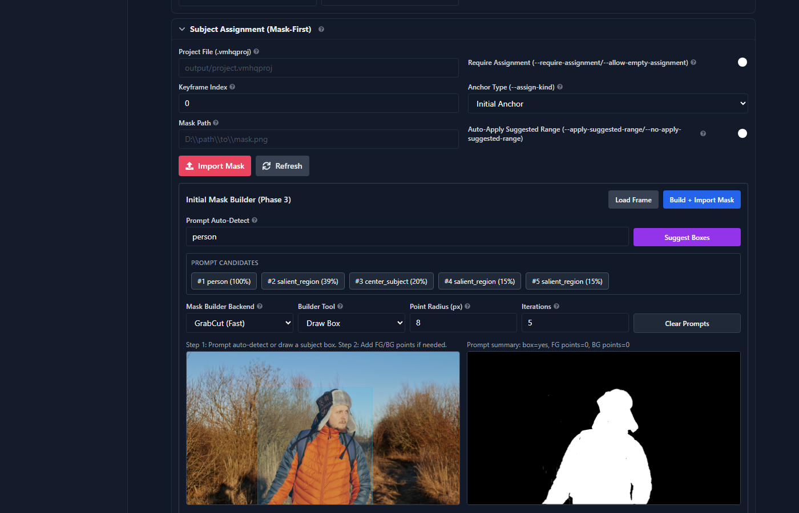
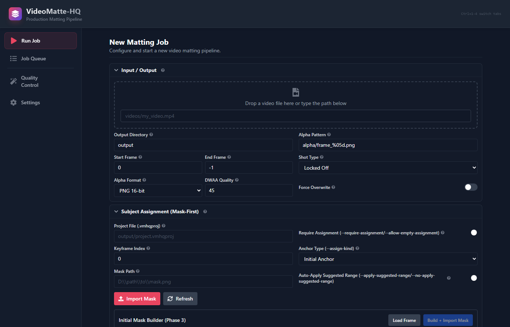
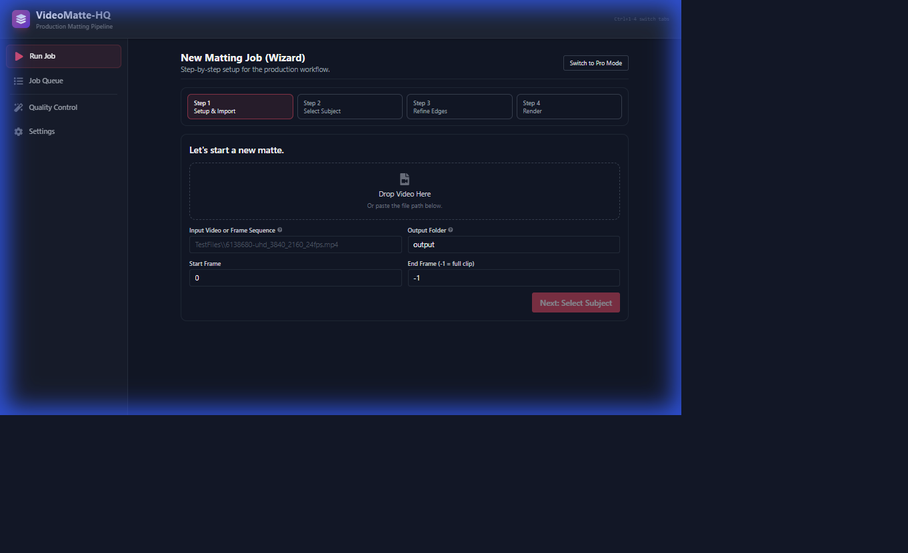
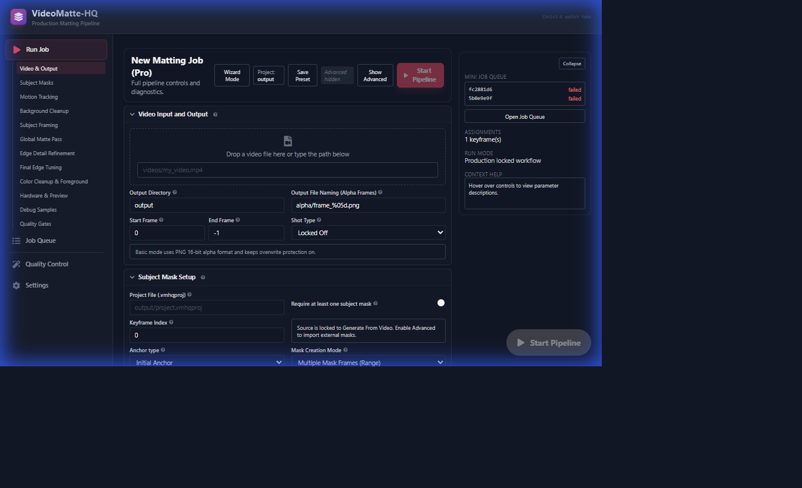

# VideoMatte-HQ

Offline Option B video matting pipeline for people footage.





The current implementation is a mask-first, assignment-driven workflow locked to:
- Stage 0: load frames
- Stage 1: load/create project and keyframe assignments
- Stage 2: MatAnyone coarse alpha (low-res temporal pass)
- Stage 3: MEMatte edge refinement (high-res tiled pass)
- Stage 4: confidence-gated temporal cleanup
- Stage 5: matte tuning (shrink/grow, feather, XY offset)
- Stage 6: output write + QC metrics/gates

## What Changed
- Old multi-stage flow-stabilized pipeline is removed from runtime.
- Project-backed mask-first assignment (`.vmhqproj`) is required by default.
- Correction anchors support suggested partial reprocess ranges.
- Phase 3 Initial Mask Builder is integrated in UI/API with `GrabCut` and optional `SAM` backend.
- Stage 1 range build uses SAM2/Samurai video predictor for anchor-prompt tracking.
- Phase 4 long-range propagation assist uses SAM2/Samurai (flow fallback disabled).
- Stage 2 region constraint prior uses propagated subject masks (not bbox-only fallback).
- Stage-by-stage sample exports plus diagnosis reports help isolate which pass introduces artifacts.
- Built-in QC metrics and regression gates can fail runs automatically.
- QC failures can auto-trigger stage diagnosis export (`debug_stages/diagnosis.json` + `.md`) even when manual debug export is off.
- Stage 4 now includes a toggleable temporal mitigation pack for edge flicker control (edge-band EMA, confidence clamp, edge snap gate).

## Requirements
- Python 3.10+
- Windows/Linux/macOS
- Optional CUDA GPU (CPU also supported)

## Install
```bash
python -m venv .venv
.venv\Scripts\pip install -e .
```

## Quick Start (CLI)

1. Import an initial assignment mask:
```bash
videomatte-hq \
  --input input_frames/frame_%05d.png \
  --project output/project.vmhqproj \
  --assign-mask masks/mask_00000.png \
  --assign-frame 0 \
  --assign-kind initial \
  --assign-only
```

2. Run the Option B pipeline with QC gates enabled:
```bash
videomatte-hq \
  --input input_frames/frame_%05d.png \
  --out output/alpha/%05d.png \
  --project output/project.vmhqproj \
  --require-assignment \
  --qc \
  --qc-fail-on-regression
```

3. Add a correction anchor and auto-apply suggested reprocess range:
```bash
videomatte-hq \
  --input input_frames/frame_%05d.png \
  --project output/project.vmhqproj \
  --assign-mask masks/mask_00120.png \
  --assign-frame 120 \
  --assign-kind correction \
  --apply-suggested-range
```

4. Phase 4 propagation assist (add long-range correction anchors from one keyframe):
```bash
videomatte-hq \
  --input input_frames/frame_%05d.png \
  --project output/project.vmhqproj \
  --propagate-from-frame 0 \
  --propagate-range-start 0 \
  --propagate-range-end 240 \
  --propagate-backend sam2_video_predictor \
  --propagate-samurai-model-cfg third_party/samurai/sam2/sam2/configs/sam2.1/sam2.1_hiera_l.yaml \
  --propagate-samurai-checkpoint third_party/samurai/checkpoints/sam2.1_hiera_large.pt \
  --propagate-stride 12 \
  --propagate-max-new-keyframes 20 \
  --propagate-only
```

5. Apply matte tuning (trimap width, grow, feather, offset):
```bash
videomatte-hq \
  --input input_frames/frame_%05d.png \
  --out output/alpha/%05d.png \
  --project output/project.vmhqproj \
  --unknown-band-px 64 \
  --mt-shrink-grow-px 1 \
  --mt-feather-px 1 \
  --mt-offset-x-px 0 \
  --mt-offset-y-px 0
```

## Launcher
`run_videomatte.bat` includes tuned QC defaults and hard gating:
- `QC_FAIL_ON_REGRESSION=1`
- `QC_MAX_P95_FLICKER=0.005`
- `QC_MAX_P95_EDGE_FLICKER=0.02`
- `QC_MIN_MEAN_EDGE_CONFIDENCE=0.22`
- `QC_BAND_SPIKE_RATIO=1.8`
- `QC_MAX_BAND_SPIKE_FRAMES=3`
- `QC_MAX_OUTPUT_ROUNDTRIP_MAE=0.002`

## Key CLI Flags

### I/O and run control
- `--input`, `--out`, `--project`
- `--start`, `--end`
- `--device`, `--precision`, `--workers`
- `--resume/--no-resume`

### Assignment workflow
- `--require-assignment/--allow-empty-assignment`
- `--assign-mask`, `--assign-frame`
- `--assign-kind {initial,correction}`
- `--apply-suggested-range/--no-apply-suggested-range`
- `--assign-only`

### Phase 4 propagation assist
- `--propagate-from-frame`
- `--propagate-range-start`, `--propagate-range-end`
- `--propagate-backend` (`sam2_video_predictor` runtime-locked)
- `--propagate-stride`
- `--propagate-max-new-keyframes`
- `--propagate-overwrite-existing/--no-propagate-overwrite-existing`
- `--propagate-flow-downscale`
- `--propagate-flow-min-coverage`
- `--propagate-flow-max-coverage`
- `--propagate-flow-feather-px`
- `--propagate-samurai-model-cfg`
- `--propagate-samurai-checkpoint`
- `--propagate-samurai-offload-video-to-cpu/--no-propagate-samurai-offload-video-to-cpu`
- `--propagate-samurai-offload-state-to-cpu/--no-propagate-samurai-offload-state-to-cpu`
- `--propagate-kind`, `--propagate-source`
- `--propagate-only`

### Stage debug exports
- `--debug-stage-samples/--no-debug-stage-samples`
- `--debug-auto-on-qc-fail/--no-debug-auto-on-qc-fail`
- `--debug-sample-count`
- `--debug-sample-frames`
- `--debug-auto-sample-frames`
- `--debug-stage-dir`

### Memory core
- `--memory-backend` (`matanyone` runtime-locked)
- `--memory-frames`
- `--window`

### Memory region constraint
- `--memory-region-constraint/--no-memory-region-constraint`
- `--memory-region-source` (`propagated_mask` runtime-locked)
- `--memory-region-anchor-frame`
- `--memory-region-backend` (`sam2_video_predictor` runtime-locked)
- `--memory-region-fallback-to-flow/--no-memory-region-fallback-to-flow` (forced off at runtime)
- `--memory-region-flow-downscale`
- `--memory-region-flow-min-coverage`
- `--memory-region-flow-max-coverage`
- `--memory-region-flow-feather-px`
- `--memory-region-samurai-model-cfg`
- `--memory-region-samurai-checkpoint`
- `--memory-region-samurai-offload-video-to-cpu/--no-memory-region-samurai-offload-video-to-cpu`
- `--memory-region-samurai-offload-state-to-cpu/--no-memory-region-samurai-offload-state-to-cpu`
- `--memory-region-threshold`
- `--memory-region-bbox-margin-px`
- `--memory-region-bbox-expand-ratio`
- `--memory-region-dilate-px`
- `--memory-region-soften-px`
- `--memory-region-outside-conf-cap`

### QC and regression gates
- `--qc/--no-qc`
- `--qc-fail-on-regression/--no-qc-fail-on-regression`
- `--qc-auto-stage-diagnosis/--no-qc-auto-stage-diagnosis`
- `--qc-sample-output-frames`
- `--qc-max-output-roundtrip-mae`
- `--qc-alpha-range-eps`
- `--qc-max-p95-flicker`
- `--qc-max-p95-edge-flicker`
- `--qc-min-mean-edge-confidence`
- `--qc-band-spike-ratio`
- `--qc-max-band-spike-frames`

### Matte tuning
- `--unknown-band-px` (alias: `--mt-trimap-width-px`)
- `--matte-tuning/--no-matte-tuning`
- `--mt-shrink-grow-px`
- `--mt-feather-px`
- `--mt-offset-x-px`
- `--mt-offset-y-px`

### Temporal cleanup mitigation pack (Stage 4)
- `--tc-outside-ema-enabled/--no-tc-outside-ema-enabled`
- `--tc-confidence-clamp/--no-tc-confidence-clamp`
- `--tc-edge-band-ema/--no-tc-edge-band-ema`
- `--tc-edge-band-ema-strength`
- `--tc-edge-band-min-confidence`
- `--tc-edge-snap-min-confidence`

## QC Outputs
When QC is enabled, artifacts are written under:
- `output_dir/qc/optionb_metrics.json`
- `output_dir/qc/optionb_report.md`

Metrics include:
- alpha validity/range checks
- p95 temporal flicker
- p95 edge-band flicker
- mean edge confidence
- band coverage spike detection
- sampled output roundtrip MAE (written output vs in-memory alpha)

If `fail_on_regression` is enabled, any failed gate causes a non-zero run exit.

## Web UI
Run:
```bash
run_web.bat
```
Then open `http://localhost:5173`.

### Dual-Mode Interface
The application now features two distinct modes to suit different workflows:

#### 1. Wizard Mode (Default)
A guided, step-by-step experience designed for new users and standard jobs.
- **Step 1: Setup**: Drag-and-drop import and IO configuration.
- **Step 2: Select Subject**: Interactive mask builder with auto-detect and SAM2 integration.
- **Step 3: Refine Edges**: Simplified controls for matte tightness and softness.
- **Step 4: Render**: Live job progress and result preview.



#### 2. Pro Mode
A comprehensive dashboard for power users requiring granular control over the entire pipeline.
- Access detailed settings for **Memory**, **Refine**, **Temporal Cleanup**, and **QC**.
- **Sticky Start Button**: Always-available "Start Pipeline" action.
- **Advanced Debugging**: Access to stage samples and debug exports.



### Video Demos
- **[Wizard Workflow Demo](docs/images/ui_wizard_demo.webp)**
- **[Pro Dashboard Demo](docs/images/ui_pro_demo.webp)**

### Keyboard Shortcuts
- `Ctrl+1-4`: Switch tabs (Run, Queue, QC, Settings)
- **Mask Builder**:
    - `F`: Add Foreground point
    - `B`: Add Background point
    - `Enter`: Build mask
- **QC Tab**:
    - `J` / `K`: Previous / Next frame
    - `Shift + J/K`: Jump 10 frames

## Quick Start (CLI)
If you prefer the command line...

## API Endpoints (current)
- `POST /api/jobs`
- `GET /api/jobs`
- `GET /api/jobs/{job_id}`
- `GET /api/jobs/{job_id}/logs`
- `POST /api/jobs/{job_id}/cancel`
- `GET /api/fs/input-suggestions`
- `POST /api/fs/path-info`
- `POST /api/project/state`
- `POST /api/assignments/import`
- `POST /api/assignments/suggest-range`
- `POST /api/assignments/frame-preview`
- `POST /api/assignments/build-mask`
- `POST /api/assignments/build-mask-range`
- `POST /api/assignments/suggest-boxes`
- `POST /api/assignments/propagate`
- `GET /api/qc/info`

## Config Schema (runtime)
Top-level sections used by Option B runtime:
- `io`
- `project`
- `assignment`
- `memory`
- `refine`
- `temporal_cleanup`
- `matte_tuning`
- `preview`
- `qc`
- `runtime`
- `debug`

Example (`my_config.yaml`):
```yaml
io:
  input: "input_frames/frame_%05d.png"
  output_dir: "output"
  output_alpha: "alpha/%05d.png"
  frame_start: 0
  frame_end: -1

project:
  path: "output/project.vmhqproj"

assignment:
  require_assignment: true

memory:
  backend: "matanyone"
  memory_frames: 12
  window: 120
  region_constraint_enabled: true
  region_constraint_source: "propagated_mask"
  region_constraint_backend: "sam2_video_predictor"
  region_constraint_fallback_to_flow: false
  region_constraint_samurai_model_cfg: "third_party/samurai/sam2/sam2/configs/sam2.1/sam2.1_hiera_l.yaml"
  region_constraint_samurai_checkpoint: "third_party/samurai/checkpoints/sam2.1_hiera_large.pt"
  region_constraint_bbox_margin_px: 96
  region_constraint_dilate_px: 24

refine:
  enabled: true
  backend: "mematte"
  mematte_repo_dir: "third_party/MEMatte"
  mematte_checkpoint: "third_party/MEMatte/checkpoints/MEMatte_ViTS_DIM.pth"
  mematte_max_number_token: 18500
  mematte_patch_decoder: true
  unknown_band_px: 64
  tile_size: 1536
  overlap: 96

temporal_cleanup:
  enabled: true
  outside_band_ema_enabled: true
  outside_band_ema: 0.15
  min_confidence: 0.5
  confidence_clamp_enabled: true
  edge_band_ema_enabled: false
  edge_band_ema: 0.06
  edge_band_min_confidence: 0.65
  edge_snap_min_confidence: 0.0

matte_tuning:
  enabled: true
  shrink_grow_px: 0
  feather_px: 0
  offset_x_px: 0
  offset_y_px: 0

qc:
  enabled: true
  fail_on_regression: true
  auto_stage_diagnosis_on_fail: true
  max_p95_flicker: 0.005
  max_p95_edge_flicker: 0.02
  min_mean_edge_confidence: 0.22
  band_spike_ratio: 1.8
  max_band_spike_frames: 3
  max_output_roundtrip_mae: 0.002

runtime:
  device: "cuda"
  precision: "fp16"
  workers_io: 4
  resume: true

debug:
  export_stage_samples: false
  auto_stage_samples_on_qc_fail: true
  sample_count: 5
  sample_frames: [0, 40, 81, 122, 162]
  auto_sample_frames: []
  stage_dir: "debug_stages"
```

Run with config:
```bash
videomatte-hq --config my_config.yaml
```

Or enable MEMatte from CLI:
```bash
videomatte-hq --config my_config.yaml --refine-backend mematte ^
  --refine-mematte-repo-dir third_party/MEMatte ^
  --refine-mematte-checkpoint third_party/MEMatte/checkpoints/MEMatte_ViTS_DIM.pth
```

## Development
Run tests:
```bash
.venv\Scripts\python -m pytest -q
```

Or use the Windows helper (always uses local `.venv`):
```bat
run_tests.bat
```

Frontend build:
```bash
cd web
npm run build
```
